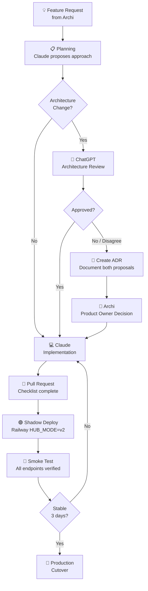
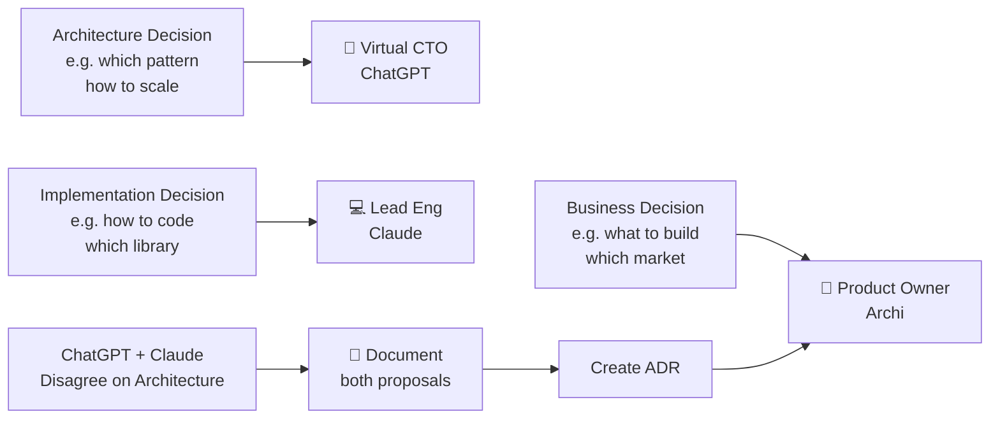
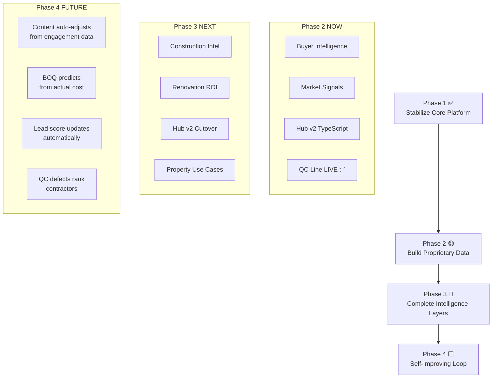

# AI Team Governance — AP-Home Platform OS

| Field | Value |
|---|---|
| **Version** | 1.2.2 |
| **Status** | Active |
| **Owner** | Product Owner (Archi) |
| **Review Cycle** | Every 90 Days |
| **Last Updated** | Jul 4, 2026 (v1.2.2 — Current System State synced to Jul 1 Hub v1 revert) |

> **This is the engineering constitution of AP-Home Platform OS.**  
> Every engineer or AI assistant must read this document before contributing to the repository.  
> This document overrides ad-hoc instructions whenever possible.

---

## 1. Purpose

This document establishes the governance model for collaboration between the human product owner (Archi) and multiple AI assistants working on AP-Home Platform OS.

AP-Home Platform OS is an AI-Native Business Operating System for the Thai real estate and construction industry, operated by บจก.อาชิดา (Achida Co., Ltd.) under the Finnhouses brand.

As the system grows in complexity — spanning multiple Railway services, Supabase, n8n automations, Vercel frontend, and WordPress publishing — a clear governance model prevents:
- Conflicting architectural decisions across sessions
- Business logic leaking into the wrong layers
- Ad-hoc rewrites that break stable systems
- Loss of institutional knowledge between AI sessions

---

## 2. Team Roles

### 👤 Product Owner — Archi (Human)

| Responsibility | Description |
|---|---|
| Business decisions | Final say on what to build and why |
| Priority | Defines what gets done first |
| Approval | No feature ships without Product Owner sign-off |
| Context | Provides real-world constraints (budget, timeline, Thai market) |

> **Rule:** If a decision affects business direction, it waits for Archi.

---

### 🧠 Virtual CTO — ChatGPT

| Responsibility | Description |
|---|---|
| Architecture | System-wide design decisions and trade-offs |
| Long-term roadmap | Phase planning, technical strategy |
| System scalability | Ensures the platform can grow without rewrites |
| Security review | Identifies vulnerabilities before they reach production |
| Technical debt | Flags accumulating debt and proposes remediation |
| Business alignment | Ensures engineering decisions support business goals |
| ADR authorship | Creates Architecture Decision Records for major choices |

> **Rule:** Architectural decisions are not implemented until ChatGPT has reviewed them (or the Product Owner explicitly waives this requirement).

---

### 💻 Lead Software Engineer — Claude

| Responsibility | Description |
|---|---|
| Coding | All implementation work |
| Refactoring | Improving code quality without changing behavior |
| Testing | Unit tests, integration tests, smoke tests |
| CI/CD | Railway deployments, build config (nixpacks.toml) |
| Pull Requests | Creating and describing PRs |
| Repository maintenance | File structure, imports, TypeScript types |
| Dependency management | package.json, package-lock.json, version pinning |

> **Rule:** Claude implements. Claude does not make unilateral architecture decisions. When in doubt, document and ask.

---

### 🔮 Future Roles (Planned)

| Role | Responsibility |
|---|---|
| AI QA Engineer | Automated test generation, regression suites |
| DevOps Engineer | Infrastructure-as-code, cost optimization, monitoring |
| Security Auditor | Penetration testing, secret scanning, RLS policy review |
| Knowledge Engineer | Maintaining memory files, session summaries, documentation |

---

## 3. Architecture Principles

These rules are non-negotiable. Any PR that violates them must be rejected.

```
┌─────────────────────────────────────────────────────────────────┐
│                    AP-Home Platform OS                          │
│                                                                 │
│  Browser / LINE / Telegram                                      │
│       ↓                                                         │
│  Vercel (Next.js 15) — API Proxy Layer only                     │
│       ↓  x-hub-token                                            │
│  ┌─────────────────────────────────┐                            │
│  │     HUB (Railway · Express)     │  ← Business Brain         │
│  │  All business logic lives here  │                            │
│  └────┬──────────┬────────┬────────┘                            │
│       ↓          ↓        ↓                                     │
│   Supabase    n8n       WordPress   (data/automation/publish)   │
│       ↓          ↓        ↓                                     │
│   LINE / Facebook / Telegram  (output channels only)            │
└─────────────────────────────────────────────────────────────────┘
```

### Non-Negotiable Rules

| Rule | Detail |
|---|---|
| **Dashboard never talks directly to AI** | All AI calls route through Hub |
| **Dashboard never talks directly to Supabase** | All DB reads/writes route through Hub |
| **Dashboard never talks directly to n8n** | Webhooks only through Hub or Vercel proxy |
| **Everything flows through Hub** | Hub is the single entry point for all business operations |
| **Hub is the Business Brain** | All business logic, all validation, all orchestration |
| **n8n is Workflow Automation only** | Schedules, webhooks, glue — not business logic |
| **Supabase is Data Layer only** | Storage and retrieval — not processing |
| **WordPress is Publishing only** | Content output — no business decisions |
| **LINE, Telegram, Facebook are output channels** | Never call business logic from these directly |
| **Incremental Migration only** | Hub v1 → Hub v2 via Shadow Mode — never Big Bang Rewrite |

---

## 4. Engineering Principles

All code in this repository must follow these principles:

### Clean Architecture

```
┌──────────────────────────────────────────┐
│  Presentation (Routes, Middleware)       │  ← HTTP boundary
│  ──────────────────────────────────────  │
│  Application (Use Cases)                 │  ← Business workflows
│  ──────────────────────────────────────  │
│  Domain (Entities, Events, Value Objects)│  ← Pure business rules
│  ──────────────────────────────────────  │
│  Infrastructure (Adapters, Repositories) │  ← External systems
└──────────────────────────────────────────┘

Dependency rule: outer layers depend on inner layers. NEVER the reverse.
```

### Required Patterns

- **SOLID** — Single Responsibility, Open/Closed, Liskov, Interface Segregation, Dependency Inversion
- **Repository Pattern** — All data access through `IStateRepository`, `IQcRepository`, etc.
- **Dependency Injection** — All dependencies injected at composition root (`server.ts`)
- **Ports and Adapters** — Infrastructure implements interfaces defined in `core/application/ports/`
- **Event-Driven Architecture** — Domain events for cross-module communication via `IEventBus`
- **TypeScript Strict Mode** — `"strict": true` always. No `any` without explicit justification.
- **Domain-Driven Design** — Use Entities, Value Objects, and Domain Events where appropriate

### Example: Dependency Direction

```typescript
// ✅ CORRECT — Use Case depends on port (interface), not concrete adapter
export class QcUseCase {
  constructor(
    private readonly ai: IAiProvider,        // port
    private readonly notifier: INotifier,    // port
    private readonly repo: IQcRepository,    // port
  ) {}
}

// ❌ WRONG — Use Case imports concrete infrastructure
import { SupabaseQcRepository } from '../infrastructure/SupabaseQcRepository';
```

---

## 4.1 Knowledge Principles

Company knowledge belongs to the platform — not to any AI, any session, or any individual contributor.

| Principle | Detail |
|---|---|
| **Knowledge belongs to the platform** | No AI agent owns knowledge. All insights, decisions, and context live in versioned files (memory/, docs/) |
| **Knowledge must be versioned** | Every significant knowledge update is committed with a date and context |
| **Knowledge must be reusable** | Written to be consumed by future sessions, future agents, and future engineers |
| **Knowledge is independent from prompts** | Prompts are ephemeral instructions. Knowledge is persistent structured data |
| **AI Agents consume Knowledge OS** | Claude reads `AI_TEAM.md`, `CLAUDE.md`, session summaries, and memory HTML before acting |
| **Prompts are temporary. Knowledge is permanent.** | A prompt not persisted dies with the session |

### Why Knowledge OS is a First-Class Architectural Component

Without a Knowledge OS, every new AI session starts blind. Engineering velocity degrades as context is re-explained, re-derived, or lost. The Knowledge OS prevents this by acting as a persistent brain that any agent (or human) can read.

```
Knowledge OS = memory/ + docs/ + session summaries + ap_home_platform_os_map.html
```

Every session must start by reading it and end by updating it.

---

## 4.2 AI Provider Policy

**Provider selection belongs to Hub. No module may hardcode a provider selection.**

All AI routing decisions are made via `core/application/ports/IAiProvider.ts` and resolved at the composition root (`server.ts`). Individual use cases call `IAiProvider` — they never import `openai`, `@google/generative-ai`, or any provider SDK directly.

### Routing Table

| Task | Primary | Fallback |
|---|---|---|
| **Reasoning / Analysis** | Claude (Sonnet) | GPT-4o |
| **Vision / Image QC** | GPT-4o Vision | Gemini Vision |
| **Embedding** | OpenAI text-embedding-3-small | — |
| **Translation / Thai language** | Gemini | GPT-4o |
| **Content generation** | GPT-4o | Claude Sonnet |

### Rules

```typescript
// ✅ CORRECT — Use Case calls IAiProvider port
export class QcUseCase {
  constructor(private readonly ai: IAiProvider) {}
}

// ❌ WRONG — Use Case imports provider directly
import OpenAI from 'openai'; // VIOLATES: provider must be injected
```

> Provider changes (e.g. switching Vision from GPT to Gemini) require an ADR.

---

## 5. AI Collaboration Workflow



### 5.1 Session Start Protocol

Every session must begin by reading the Knowledge OS in this order:

```
1. AI_TEAM.md          ← Engineering Constitution (this file)
2. CLAUDE.md           ← Stack, URLs, deployed state, preferences
3. HANDOFF.md          ← Last session's pending tasks and status
4. decisions.md        ← Architecture decisions (read before suggesting changes)
5. issues-log.md       ← Known bugs and fixes (read before debugging)
```

**Stale Memory Rule:**

| Condition | Action |
|---|---|
| HANDOFF.md last updated > 7 days ago | Flag as potentially stale — ask Archi to confirm current priorities before multi-step work |
| Memory files not found / not accessible | Use `request_cowork_directory` to mount the folder. Do not proceed without context |
| Session summary missing | Check `memory/session old/` for the most recent dated file |

> **Rule:** A session that skips context loading risks undoing previous work or repeating solved problems. Read first, act second.

---

### Example Session Flow

```
Session Start:
  Claude reads: AI_TEAM.md → CLAUDE.md → recent session summary

Feature: "Add property use case to Hub v2"
  → Claude: checks architecture compliance
  → Claude: implements IPropertyRepository port + SupabasePropertyRepository
  → Claude: implements PropertyUseCase
  → Claude: adds /api/property/* routes
  → Claude: updates docs/hub-v2/05-implementation-tasks.txt
  → Claude: commits with message "feat(hub-v2): TASK-313 Property Use Cases"

Session End:
  Claude updates: memory/ap_home_platform_os_map.html
```

---

## 6. Pull Request Checklist

Every PR must answer all of the following before merging:

```markdown
## PR Checklist

- [ ] What business problem does this solve?
- [ ] Which modules are affected?
- [ ] Does this change architecture? (If yes → ChatGPT review required)
- [ ] Are new dependencies introduced? (If yes → justify in PR description)
- [ ] Rollback plan? (e.g. revert commit hash, env var toggle)
- [ ] Tests included? (unit / integration / smoke)
- [ ] Documentation updated? (AI_TEAM.md / CLAUDE.md / os_map.html / tasks.txt)
- [ ] TypeScript compiles clean? (`tsc --noEmit` exit 0)
- [ ] No secrets hardcoded?
- [ ] Hub architecture principles respected?
- [ ] Performance impact reviewed? (response time, memory, Railway resource usage)
- [ ] AI cost impact reviewed? (new AI calls added? token usage estimated?)
- [ ] Breaking change? (yes/no — if yes, document migration path)
- [ ] Backward compatibility maintained? (existing API contracts preserved?)
```

### Commit Message Convention

```
feat(scope): short description          # new feature
fix(scope): short description           # bug fix
refactor(scope): short description      # refactor, no behavior change
docs(scope): short description          # documentation only
chore(scope): short description         # build, deps, config

# Examples
feat(hub-v2): TASK-404 FB routes with FbUseCase
fix(hub-v2): update package-lock.json with ws dependency
refactor(qc): calibrate concrete surface scoring thresholds
```

---

## 7. Decision Rules



### ADR Mandatory Triggers

An ADR at `docs/ADR/YYYY-MM-DD-topic.md` is **REQUIRED** when the change involves any of the following:

| Category | Examples |
|---|---|
| **Architecture** | New service, new layer, new communication pattern |
| **AI Provider** | Changing which model handles a task type, adding a provider |
| **Database** | New table schema, migration strategy, RLS policy change |
| **Authentication** | Changing auth method, token strategy, secret rotation policy |
| **Event Model** | New event types, changing event bus, modifying event contracts |
| **Security Model** | New access control, new secret handling pattern |
| **Public API** | Adding, removing, or breaking existing API contracts |

> If unsure whether an ADR is needed, create one. The cost of writing is lower than the cost of undocumented decisions.

### Conflict Resolution Protocol

When ChatGPT and Claude disagree on architecture:

1. **DO NOT implement immediately**
2. Claude documents Proposal A with trade-offs
3. ChatGPT documents Proposal B with trade-offs
4. Create ADR at `docs/adr/YYYY-MM-DD-topic.md`
5. Present both to Archi
6. Implement only after Product Owner approval

---

## 8. Repository Rules

These rules apply to every file in this repository:

| Rule | Rationale |
|---|---|
| **Never bypass Hub** | Security, auditability, single source of truth |
| **Never duplicate business logic** | DRY — one place to fix, one place to test |
| **Never hardcode secrets** | Use Railway Variables / `.env` — never commit |
| **Never call infrastructure directly from Presentation Layer** | Violates Clean Architecture dependency rule |
| **Maintain dependency direction** | Domain ← Application ← Infrastructure ← Presentation |
| **Prefer composition over inheritance** | More flexible, easier to test |

### Prohibited Patterns

```typescript
// ❌ Route calling Supabase directly
router.get('/state', async (req, res) => {
  const { data } = await supabase.from('hub_state').select('*'); // WRONG
});

// ✅ Route calling Use Case
router.get('/state', async (req, res) => {
  const state = await stateUseCase.getState(); // CORRECT
});

// ❌ Hardcoded secret
const secret = 'b3672e1c252790351ace...'; // WRONG — commit this = security breach

// ✅ Environment variable
const secret = process.env.HUB_SECRET!; // CORRECT
```

---

## 9. Observability Principles

Observability is mandatory for every production service. A system that cannot be observed cannot be operated safely.

Every Hub service must expose or emit:

| Signal | What to Measure | Where |
|---|---|---|
| **Metrics** | Request count, error rate, latency p50/p95 | Railway metrics / Supabase |
| **Tracing** | Request path through Hub → Use Case → Repository | Structured logs with `requestId` |
| **Audit Logs** | Who triggered what, when, with what result | Supabase `audit_log` table |
| **AI Cost** | Tokens consumed per request, per model, per day | Hub middleware → Supabase |
| **Performance** | Response time per endpoint, queue depth | Railway logs + HealthMonitor |
| **Monitoring** | HealthMonitor polls every 5 minutes; alerts on stuck jobs >60 min | Telegram alert channel |

> If it's in production and you can't answer "is it healthy right now?", it violates this principle.

---

## 10. Service Registry Principle

All services must register themselves centrally via Hub. Hidden dependencies between services are prohibited.

**Planned service registry entries:**

| Module | Purpose | Status |
|---|---|---|
| Property | Property data, listing management | Planned (TASK-313) |
| CRM | Lead pipeline, buyer tracking | Partial |
| Marketing | Content, FB publishing, SEO | Live (n8n) |
| Knowledge | Market data, cost benchmarks | Planned |
| AI | Provider routing, cost tracking | Partial (IAiProvider) |
| Workflow | n8n trigger orchestration | Live |
| Health | HealthMonitor, uptime checks | Live (TASK-314) |

> A module that creates its own external dependencies without registering with Hub creates an invisible failure surface. Register first, connect second.

---

## 11. Future Architecture

> **Priority C — Document only. Do NOT implement until explicitly scheduled.**

These capabilities belong to Phase 2–4 of the platform roadmap. They are defined here to ensure current architecture decisions remain compatible with future direction.

| Capability | Phase | Description |
|---|---|---|
| **Knowledge OS** | Phase 2 | Structured, versioned knowledge graph that AI agents query instead of relying on session context |
| **Agent Layer** | Phase 3 | Specialized AI agents (QC Agent, Market Agent, Content Agent) orchestrated by Hub |
| **Executive Intelligence** | Phase 3 | Automated KPI dashboards, anomaly detection, decision recommendations for Archi |
| **Self-Improving Intelligence Loop** | Phase 4 | System uses its own performance data to improve prompts, weights, and routing decisions |

Current architecture must not block these. Specifically:
- Hub's `IAiProvider` port already supports future agent routing
- Clean Architecture layers allow Agent Layer to plug in at Application layer
- Knowledge OS will consume the same `memory/` directory structure already in use

---

## 12. n8n Workflow Governance

n8n is the automation layer of AP-Home Platform OS. All workflows must follow these conventions to remain maintainable across sessions.

### Naming Convention

```
wf_{domain}_{feature}.json

Examples:
  wf_crm_note_parser.json
  wf_fb_post_performance_tracker.json
  wf_qc_line_hardcoded.json
  wf_blog_article_publish.json
```

### File Lifecycle Rules

| Action | Rule |
|---|---|
| **New workflow** | Create in `memory/n8n-workflows/` with `wf_` prefix |
| **Deprecated workflow** | Move to `memory/n8n-workflows/archive/` with date suffix before deleting from n8n |
| **Breaking change** | Create new file (new name or `_v2` suffix) — do not overwrite the working version |
| **Before importing** | Verify node list: `python3 -c "import json; wf=json.load(open(PATH)); print([n['name'] for n in wf['nodes']])"` |

### Activation Rules

- **Never activate 2 workflows with the same webhook path simultaneously** — causes routing conflicts
- When replacing a workflow: Deactivate old → Import new → Verify nodes → Activate new → Delete old
- `versionId` in JSON tracks internal version — increment comment when making significant changes

### Code Node Rules (n8n 2.21.4+)

| Rule | Detail |
|---|---|
| HTTP calls | Use `this.helpers.httpRequest({body: obj, json: true})` — never `fetch()` |
| Telegram | Use native `n8n-nodes-base.telegram` + credential — never raw HTTP in Code node |
| JSON POST | Use `n8n-nodes-base.code` node + `require('https')` for endpoints using `express.json()` |
| Binary upload | HTTP Request v4: `sendBody:true, contentType:"binaryData", inputDataFieldName:"data"` |
| `$env` access | Available in `EXECUTIONS_MODE=own` (current) — not available in `queue` mode |
| `alwaysOutputData` | Must be top-level in node object, not inside `parameters.options` |

---

## 13. Secret Rotation Policy

No secret is permanent. Every credential has a rotation schedule.

| Secret | Rotation Schedule | Where to Renew | Where to Update |
|---|---|---|---|
| `FB_PAGE_ACCESS_TOKEN` | ~60 days (next: **Aug 2, 2026**) | Graph API Explorer → Page Token → exchange for Long-lived | Railway `easygoing-friendship` env var |
| `LINE_CHANNEL_ACCESS_TOKEN` | On 401 error | LINE Developers Console → Messaging API → Issue new token | n8n workflow node (hardcoded) |
| `HUB_SECRET` | On suspected breach | Generate new random string | Railway: Hub + easygoing-friendship + Vercel env vars (all 3 simultaneously) |
| `OPENAI_API_KEY` | Annually / on breach | platform.openai.com → API Keys | Railway Hub env var |
| `SUPABASE_SERVICE_KEY` | Annually / on breach | Supabase Dashboard → Project Settings → API | Railway Hub env var + n8n env var |
| `TELEGRAM_BOT_TOKEN` | On suspected breach | @BotFather → /revoke | n8n Credentials (`Telegram account`) |

### Rules

- **Never store secrets in code or commit to git** — use Railway Variables / Vercel env vars only
- When renewing any secret: update **ALL services that use it simultaneously** before the old one expires
- After rotating `HUB_SECRET`: verify Hub health endpoint + re-test n8n → Hub calls + re-test Vercel → Hub proxy
- FB Long-lived token: always exchange Short-lived → Long-lived via `fb_exchange_token` before storing
- Document the renewal in `memory/tokens.md` with new expiry date

---

## 14. Incident Response

When production systems break, follow this protocol. Do not guess — diagnose first.

### Severity Levels

| Level | Definition | Response Time |
|---|---|---|
| **P0** | System down — QC Line, Hub, n8n, or Dashboard not responding | Immediate |
| **P1** | Feature broken — FB publish fails, Blog Runner errors, QC wrong results | Same day |
| **P2** | Degraded — partial failure, fallback working, non-critical feature broken | Within 3 days |

### Response Protocol

```
1. IDENTIFY   → Check Railway logs + n8n execution history + Supabase logs
                 Never guess root cause from symptoms alone

2. CONTAIN    → Toggle workflow off / revert last commit / disable feature via env var
                 Prevent further damage before fixing

3. FIX        → Implement fix. Test locally or on shadow service first if possible
                 Reference decisions.md and issues-log.md before touching known-sensitive areas

4. VERIFY     → Confirm resolution with real data (send test image / run test workflow / check logs)
                 Do not mark resolved until verified

5. DOCUMENT   → Update issues-log.md with: symptom, root cause, fix, prevention
                 Update decisions.md if the fix establishes a new rule
```

### Common Diagnostic Commands

```bash
# Check n8n execution history (most recent 10)
# → n8n UI → Executions → filter by workflow

# Check Railway logs
# → Railway dashboard → Service → Logs tab → filter by timeframe

# Check Hub health
curl https://ap-home-platform-production.up.railway.app/health

# Check n8n webhook registration (Telegram)
curl "https://api.telegram.org/bot{TOKEN}/getWebhookInfo"
```

---

## 15. AI Cost Budget

AI API calls cost real money. Every session must be cost-aware.

### Monthly Budget Thresholds

| Provider | Service | Monthly Budget | Alert Threshold |
|---|---|---|---|
| **OpenAI** | GPT-4o Vision (QC) + content gen | $20 | $15 |
| **Anthropic** | Claude Sonnet (reasoning) + Haiku (parsing) | $10 | $8 |
| **Google** | Gemini (image gen fallback + Thai translation) | $5 | $4 |
| **Total** | — | **$35** | **$27** |

### Rules

- Review API usage dashboards **weekly** (platform.openai.com · console.anthropic.com)
- If cost exceeds alert threshold → identify highest-consumption workflow → optimize prompt length or switch to cheaper model
- New AI calls added to any workflow → estimate token cost in PR description
- Prefer **Claude Haiku** over Sonnet for parsing/classification tasks (5–10x cheaper per token)
- Prefer **Gemini** over GPT-4o for image generation fallback (lower cost per image)

### Cost per Operation (estimates)

| Operation | Model | Estimated Cost |
|---|---|---|
| QC inspection (1 image) | GPT-4o Vision | ~$0.01 |
| Blog article generation | GPT-4o | ~$0.05 |
| CRM note parse | Claude Haiku | ~$0.001 |
| Market intel generation | Claude Sonnet | ~$0.01 |
| FB image generation | gpt-image-1 | ~$0.04 |

---

## 16. QC Prompt Change Protocol

`QC_SYSTEM_PROMPT` in `server.cjs` directly affects construction quality assessment results. Changes must be tested before production.

### Before Any QC Prompt Change

1. **Document the reason** in `decisions.md` — what was wrong, what changed, why
2. **Test with 3 representative images** minimum:
   - **Structural concrete** (ฐานราก/เสา/คาน) → expected score ≥ 80, texture ขรุขระ must NOT be flagged
   - **Floor/walkway concrete** (พื้น/ทางเดิน) → rough surface = defect, expected score < 60
   - **Pre-pour** (ก่อนเท) → checks rebar + formwork, not surface; mild rust = normal
3. **Verify scoring thresholds** meet these minimums before pushing:
   - Structural concrete with normal texture → `score ≥ 80`, no defect items for surface roughness
   - Genuine defect (Honeycombing ≥1cm, transverse crack) → `score ≤ 50`
4. **git push origin main** → Railway auto-deploy → wait ~60 seconds for redeploy
5. **Send test image via LINE OA** → verify reply language is Thai, score is correct, defects are accurate
6. **Update issues-log.md** with test result

### Dual-Prompt Consistency Rule

When editing `QC_SYSTEM_PROMPT` in `server.cjs` (v1 · LIVE):
- **Also apply the same logic** to `QC_PROMPT` in `src/modules/qc/QcUseCase.ts` (v2 · Shadow)
- This prevents v1/v2 behavioral divergence when Hub v2 goes live (TASK-601)

### Concrete Classification Reference (Jun 28, 2026)

| Type | What to Check | Surface ขรุขระ = |
|---|---|---|
| **A) Structural** (ฐานราก/ฟุตติ้ง/เสา/คานใต้ดิน) | Honeycombing ≥1cm, transverse cracks | **ปกติ** |
| **B) Floor/Walkway** (พื้น/ทางเดิน) | Surface evenness, cracks | **Defect** |
| **C) Pre-pour** (ก่อนเทคอนกรีต) | Rebar spacing, formwork alignment | **N/A** (no surface yet) |

> Rule 8 (benefit of doubt): If uncertain whether a condition is a defect or normal characteristic → classify as normal.

## 17. Future Vision

> *"AP-Home Platform OS is evolving into an AI-Native Business Operating System for the real estate and construction industry in Thailand."*

All future work must support this vision:



Every feature we build today must feed data into this intelligence loop. We are not building isolated tools — we are building a system that learns.

---

> **Engineering North Star**
>
> *Every engineering decision must make AP-Home more intelligent, more maintainable, or more valuable to customers.*
>
> *If it does none of these, reconsider the work.*

---


---

## Current System State

> ⚠️ **Jul 1, 2026 — Hub v2 cutover REVERTED.** `fb/blog queue` routes were never actually implemented on Hub v2 (see `decisions.md` ADR-004, `issues-log.md` ISSUE-005). Production routing is back on Hub v1 until those routes are built and smoke-tested. This table (and the routing table below) reflects that reality, not the Jun 30 cutover attempt.

| Service | Status | URL |
|---|---|---|
| Dashboard | ✅ Live | ap-home-platform.vercel.app |
| Hub v1 | ✅ **Live — production traffic** | ap-home-platform-production.up.railway.app |
| Hub v2 | 🟡 Shadow only (~79-82% built, not serving traffic) | exciting-creativity-production-4b85.up.railway.app |
| n8n | ✅ Live | primary-production-8158a.up.railway.app |
| Supabase | ✅ Live | PostgreSQL + Storage |
| WordPress | ✅ Live | finnhouses.com |
| QC Line | ✅ Live (feedback loop added Jul 2) | LINE OA → GPT-4o Vision |

### n8n Workflow Routing (as of Jul 4, 2026 — post-revert)

| Workflow | Active Version | Hub Endpoint | Status |
|---|---|---|---|
| Queue Auto-run | v4 | Hub **v1** `/action/blog\|fb/queue/run-next` via Vercel proxy | ✅ Active |
| WF1 Article + Publish | v8 (wb_fix) | Hub **v1** `/webhook/n8n?token=<hmac>` | ✅ Active (verify v8 in n8n — still pending) |
| WF2 Image + Patch | v5 (hub_v2 file name, points at v1 now) | Hub **v1** `/webhook/image-done` | ✅ Active |
| Wake-up | latest | Hub **v1** `/api/state` | ✅ Active |
| wf_qc_line (2) | current | Hub **v1** `/api/qc/ingest` + `/api/qc/feedback` | ✅ Active |

Header for all Hub v1 calls: `x-hub-token` (not `x-hub-secret` — that's the Hub v2 convention, currently unused in production).

---

*Last updated: Jul 4, 2026 · v1.2.2 · doc-sync pass by Claude (Lead Software Engineer) — corrected Current System State + routing table to reflect Jul 1 Hub v1 revert; no architecture/governance changes*  
*Next review: Sep 28, 2026 (90-day cycle) or after Hub v2 cutover (TASK-601/602/603)*
